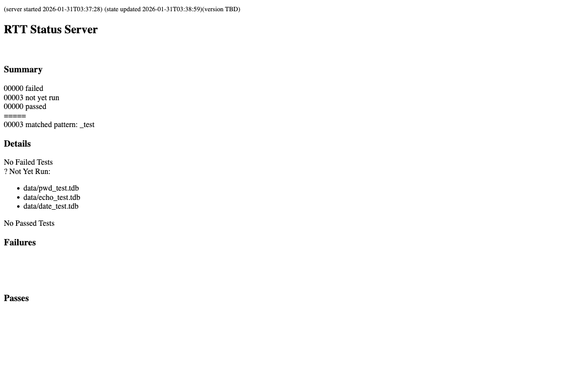
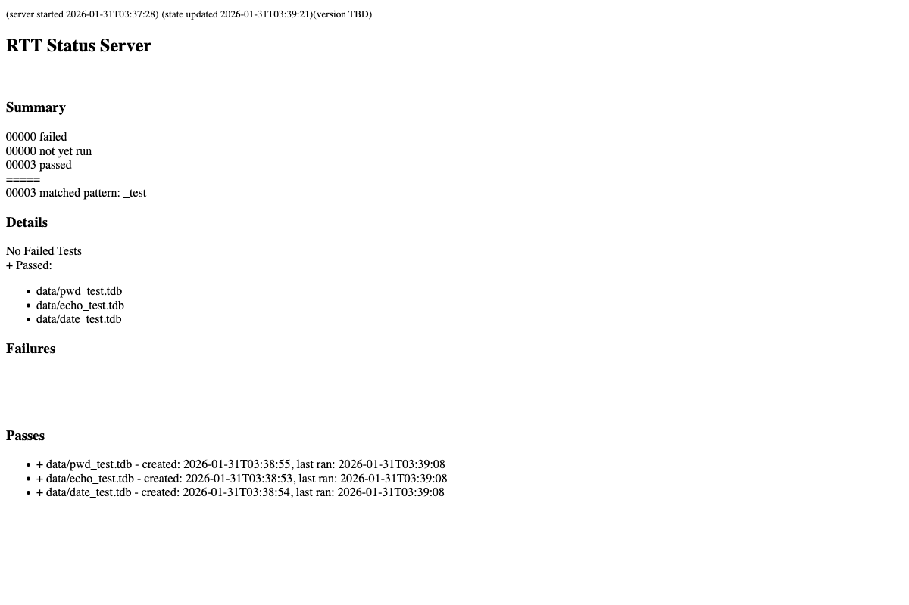
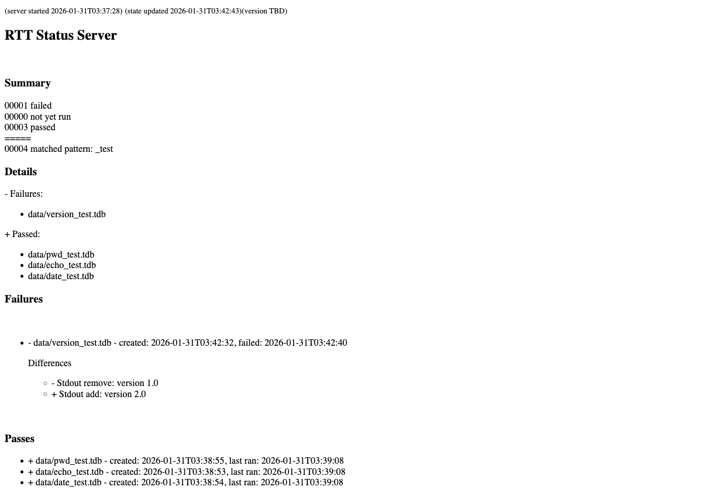

# reg-rs Status Server

The reg-rs status server provides a web-based interface for monitoring regression test results in real-time. It's particularly useful for long-running test suites where you want to track progress without constantly running reports from the command line.

## Use Cases

### 1. Monitoring Long-Running Test Suites
When running a large number of regression tests, the status server provides a live dashboard showing:
- Total number of tests matching your pattern
- How many tests have passed, failed, or haven't run yet
- Detailed diff information for any failures

### 2. Continuous Integration Monitoring
Run the status server alongside your CI pipeline to provide a visual dashboard that team members can check at any time.

### 3. Development Workflow
During development, keep the status server running in the background. As you make changes and re-run tests, the page automatically updates to reflect the current state.

## Usage

### Starting the Server

```bash
# Basic usage - monitor all tests matching a pattern
reg-rs status -p "_test"

# Specify a custom port (default is 4740)
reg-rs status -p "_test" -l 8080

# Using the alias
reg-rs s -p "my_tests"
```

### Command Options

| Option | Description |
|--------|-------------|
| `-p, --pattern <pattern>` | Substring pattern to match test names (default: all) |
| `-l, --localhost-port <port>` | Port number for the web server (default: 4740) |

### Accessing the Dashboard

Once the server starts, open your browser to:
```
http://localhost:4740/
```

The server will display a message like:
```
open: http://127.0.0.1:4740/
Listening at 127.0.0.1:4740.  Ctrl-C to terminate server
```

## Dashboard Views

### Tests Not Yet Run

When tests have been created but not yet executed, they appear in the "Not Yet Run" section:



The dashboard shows:
- **Summary counts**: Failed, Not Yet Run, Passed, and Total tests
- **Not Yet Run list**: Names of tests awaiting execution

### All Tests Passing

After running tests successfully, the dashboard updates to show passing tests:



The summary section shows the count of passed tests, and the "Passes" section lists each passing test.

### Regression Detected

When a test detects a difference between the original baseline and the latest run, it appears as failed:



The dashboard displays:
- **Failed count** in the summary
- **Failed test names** in the Details section
- **Diff information** showing what changed (stdout additions/removals, stderr changes, exit code differences)

## Real-Time Updates

The status server automatically detects changes to test database files via filesystem watching and pushes updates to the browser using **Server-Sent Events (SSE)**. When you:

1. Create a new test (`reg-rs create ...`)
2. Run tests (`reg-rs run ...`)
3. Remove tests (`reg-rs remove ...`)

The dashboard updates automatically — no manual refresh needed. The footer shows an SSE event counter (`live ● N updates`) confirming the connection is active.

### How it works

1. A file-watcher thread (using `notify`) monitors the data directory for changes
2. Changes are broadcast via a `tokio::sync::broadcast` channel
3. The `/events` SSE endpoint streams update notifications to connected browsers
4. Client-side JavaScript fetches the updated page and swaps the DOM content
5. The SSE counter increments with each update

### API Endpoint

A JSON API is available for programmatic access:

```bash
curl http://localhost:4740/api/status
# {"pattern":"...","tests":[...],"fail_count":0,"pass_count":5,...}
```

## Example Workflow

```bash
# Terminal 1: Start the status server
reg-rs status -p "_test" -l 4740

# Terminal 2: Create and run tests
reg-rs create -t hello_test -c 'echo hello'
reg-rs create -t version_test -c 'cat VERSION'

# Run the tests
reg-rs run -p "_test"

# Check the browser - tests should show as passed

# Simulate a regression by changing the VERSION file
echo "2.0.0" > VERSION

# Re-run tests
reg-rs run -p "_test"

# Check the browser - version_test should now show as failed
# with diff showing the change from old version to new
```

## Pattern Matching

The `-p` pattern option uses **substring matching**, not glob patterns:

| Pattern | Matches |
|---------|---------|
| `_test` | `hello_test.tdb`, `my_test.tdb` |
| `hello` | `hello_test.tdb`, `hello_world.tdb` |
| `.tdb`  | All tests |

**Note**: Patterns like `*.tdb` will NOT work as expected. Use substring patterns instead.

## Stopping the Server

Press `Ctrl-C` in the terminal where the server is running to stop it.

## Troubleshooting

### Server won't start (Address already in use)
Another process is using the port. Either:
- Kill the existing process: `pkill -f "reg-rs status"`
- Use a different port: `reg-rs status -p "_test" -l 8080`

### No tests found
Ensure your tests:
1. Are in an auto-discovered data directory (`./work/reg-rs/`, cwd, or `$REG_RS_DATA_DIR`)
2. Have the `.tdb` extension
3. Match your pattern (remember: substring matching, not glob)

### Page shows stale data
The page should auto-update via SSE. If it doesn't, check the footer — if it shows "disconnected", the SSE connection was lost. Refresh the page to reconnect.
